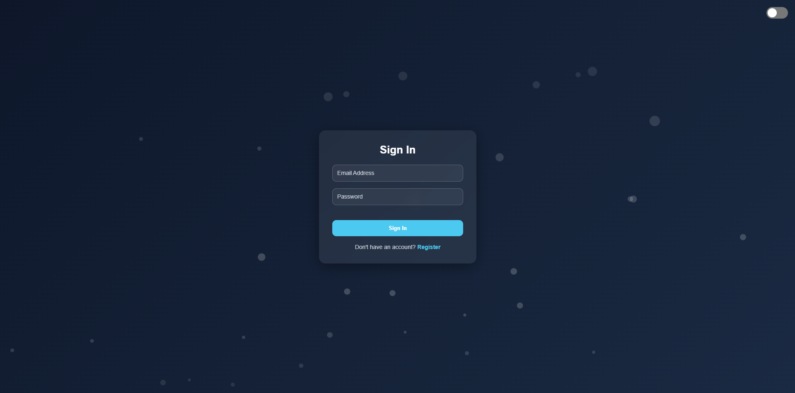

# Modern Auth UI — Sign In & Register

A modern authentication user interface with **Dark/Light theme**, **Glassmorphism UI**, **Animated Bubble Background**, and **Responsive Design** — all built using vanilla **HTML, CSS, and JavaScript**.

No external libraries or frameworks required.

---

## 🚀 Live Preview (Optional)

> You can deploy this easily using GitHub Pages, Netlify, or Vercel.

---

## 🌟 Features

* 🌙 / ☀️ **Dark & Light Theme Toggle**
* 🎨 **Glassmorphism UI Card**
* 🫧 **Animated Bubble Background**
* 📱 **Responsive Layout (Mobile Friendly)**
* 🎚 **iOS-style Theme Switch**
* 💾 **LocalStorage Theme Persistence**
* 🧩 **Floating Input Labels**
* ⚡ **No Dependencies (Pure JS / CSS / HTML)**

---

## 📂 Project Structure

```
root
│
├── sign-in.html
├── sign-in.css
├── sign-in.js
│
├── register.html
├── register.css
├── register.js
│
└── README.md
```

> *No build tools required — just open `.html` files in your browser.*

---

## 🖼 Demo Screenshots
### Sign In — PC


### Register — PC


---

## 📦 Getting Started

### 1. Clone the Repository

```sh
git clone https://github.com/YOUR-USERNAME/YOUR-REPO.git
```

Or download ZIP.

---

### 2. Open in Browser

Just open:

```
sign-in.html
register.html
```

No server required.

---

## 🧠 Technical Details

### Theme Handling

Theme is controlled using:

* CSS variables (`:root` and `.light`)
* Class toggling (`document.body.classList.toggle("light")`)
* `localStorage` persistence

Example:

```js
localStorage.setItem("theme", "light");
```

### Compatibility

Supported browsers:

* Chrome
* Edge
* Firefox
* Safari

---

## 🛠 Technologies Used

* **HTML5**
* **CSS3**

  * Glassmorphism
  * Animations
  * Transitions
  * Responsive layout
* **JavaScript**

  * LocalStorage state
  * Theme switching
  * UI behavior

---

## 🧩 Possible Improvements

Future enhancements could include:

* 🔐 Backend authentication (Node / PHP / Django / Firebase)
* 🏠 Dashboard after login
* 🎉 SweetAlert2 modals
* ✨ Form validation rules
* 🌐 Online demo deployment

---

## 🤝 Contributing

Pull requests are welcome!
For major changes, please open an issue first to discuss ideas.

---

## 📝 License

This project is licensed under the **MIT License**.
Feel free to use it in personal or commercial projects.

---

## ⭐ Acknowledgements

Thanks for checking out this UI!
If you build something cool with it, feel free to share 🙌
